  

&nbsp;

&nbsp;

---

I build end-to-end AI systems — from multi-agent LLM pipelines to production ML — with a bias toward **local, privacy-preserving inference** and evaluation I can actually defend. Final-year Applied AI student graduating **October 2026**, currently in Bavaria for my thesis semester at OTH Amberg-Weiden.

**Now:** a seven-agent LangGraph pipeline that bridges smart-home IoT sensors and a Pepper robot for elderly care, running multimodal LLMs fully on-device.

### Selected projects

**Bel Azur Travel** — full-stack travel-booking platform (Next.js · Prisma · NextAuth), deployed on Vercel &nbsp;
 **FINAIA** — credit-risk scoring; lifted default recall from 49% → **80.5%** with cost-sensitive XGBoost over 24 engineered features.
 **BoCare AI** — retrieval-augmented medical-triage assistant (educational demo) over public health sources, with jailbreak detection and hallucination filtering.

Write-ups → **[bocar-ba-portfolio.surge.sh](https://bocar-ba-portfolio.surge.sh)**

### Tech

**Languages**
 

**GenAI / Agents**
 

**Machine Learning**
 

**Backend / Infra**
 

