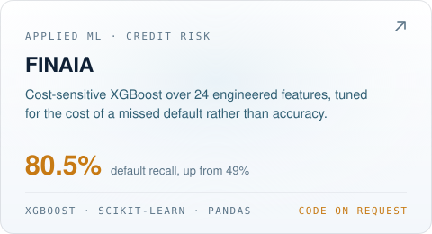
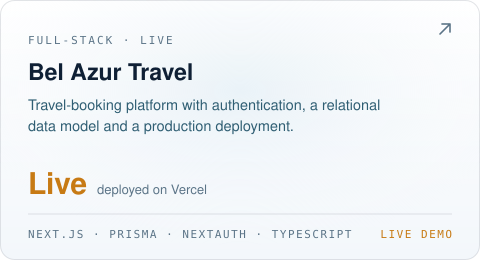
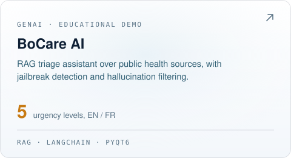
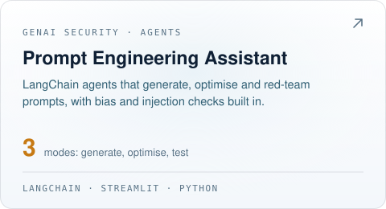
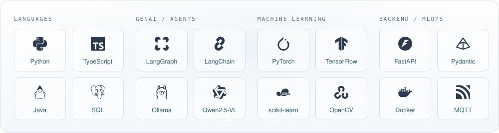

<picture>
  <source media="(prefers-color-scheme: dark)" srcset="./assets/banner-dark.svg">
  
</picture>

<a href="https://www.linkedin.com/in/bocar-ba-1781992b2"><b>LinkedIn</b></a>
&nbsp;&middot;&nbsp;
<a href="https://bocar-ba-portfolio.surge.sh"><b>Portfolio</b></a>
&nbsp;&middot;&nbsp;
<a href="https://bocar-ba-portfolio.surge.sh/cv.html"><b>CV</b></a>
&nbsp;&middot;&nbsp;
<a href="mailto:bcrtob@gmail.com"><b>Email</b></a>

Bavaria, Germany &nbsp;&middot;&nbsp; English, French &nbsp;&middot;&nbsp; Bachelor of Applied AI, 2026

 

I build end-to-end AI systems, from multi-agent LLM pipelines to production ML. I lean toward **local, privacy-preserving inference** and evaluation I can defend with numbers. I hold a **Bachelor of Applied AI** from Pristini School of AI (Tunisia). I did my thesis at **OTH Amberg-Weiden** in Germany, where it was graded **1.3** (German scale, 1.0 is best), and it received the mention **Excellent** at my home university.

**Open to junior AI / ML engineering roles**: LLM agents, applied ML, GenAI in production.

 

## Thesis

<a href="https://bocar-ba-portfolio.surge.sh/#projects"><picture><source media="(prefers-color-scheme: dark)" srcset="./assets/now-dark.svg"></picture></a>

 

## Selected work

<a href="https://bocar-ba-portfolio.surge.sh/#projects"><picture><source media="(prefers-color-scheme: dark)" srcset="./assets/card-finaia-dark.svg"></picture></a>
<a href="https://bel-azur-travel.vercel.app"><picture><source media="(prefers-color-scheme: dark)" srcset="./assets/card-belazur-dark.svg"></picture></a>
<a href="https://bocar-ba-portfolio.surge.sh/#projects"><picture><source media="(prefers-color-scheme: dark)" srcset="./assets/card-bocare-dark.svg"></picture></a>
<a href="https://bocar-ba-portfolio.surge.sh/#projects"><picture><source media="(prefers-color-scheme: dark)" srcset="./assets/card-promptlab-dark.svg"></picture></a>

Also: **Network Anomaly Detection**, an unsupervised Isolation Forest pipeline on NSL-KDD. Write-ups and demos are on the [portfolio](https://bocar-ba-portfolio.surge.sh).

 

## Experience

<picture><source media="(prefers-color-scheme: dark)" srcset="./assets/timeline-dark.svg"></picture>

<b>What I did in each role</b>

 

| Period | Role | Focus |
|:--|:--|:--|
| From Mar 2026 | **AI Research Intern** · OTH Amberg-Weiden | Thesis, graded 1.3: multi-agent orchestration across IoT sensors, Pepper / Webots and multimodal LLMs |
| Dec 2025 – Jan 2026 | **Applied ML Intern** · Ubotica Technologies | CVAT datasets; few-shot, one-shot and meta-learning (MAML) for inspection models |
| Jul – Oct 2025 | **Generative AI Intern** · Novation City | EN/FR LLM services for ESG and KPI reporting; benchmarked Gemini, Mistral and Ollama; direct LLM vs RAG; prompt-injection defences |
| Summer 2024 | **IoT Developer Intern** · Pristini School of AI | ESP8266 + Firebase smart-home system with a mobile monitoring app |
| 2023, 2024 | **BI Intern** · Banque Centrale de Mauritanie | Financial web scraping and ETL; external reserves operations |

 

## Stack

<picture><source media="(prefers-color-scheme: dark)" srcset="./assets/stack-dark.svg"></picture>

Also: C &middot; XGBoost &middot; pandas &middot; Pydantic &middot; MongoDB &middot; Next.js &middot; Prisma &middot; Streamlit &middot; Linux &middot; ESP8266

 

## How I work

**Measure first.** Every model ships with a baseline, a metric the business actually cares about, and an honest error analysis.

**Local by default.** Sensitive data shouldn't leave the device, so I try Ollama and on-prem stacks before cloud APIs.

**Guardrails are part of the build.** Input sanitisation, injection defences and fallbacks go in from the start.

 

## Activity

<picture>
  <source media="(prefers-color-scheme: dark)" srcset="https://raw.githubusercontent.com/bcr-ba/bcr-ba/output/activity-dark.svg">
  
</picture>

  

<a href="mailto:bcrtob@gmail.com"><picture><source media="(prefers-color-scheme: dark)" srcset="./assets/cta-dark.svg"></picture></a>

  

Mauritania &rarr; Tunisia &rarr; Germany

